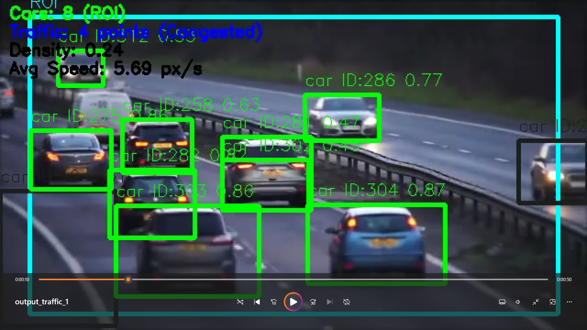
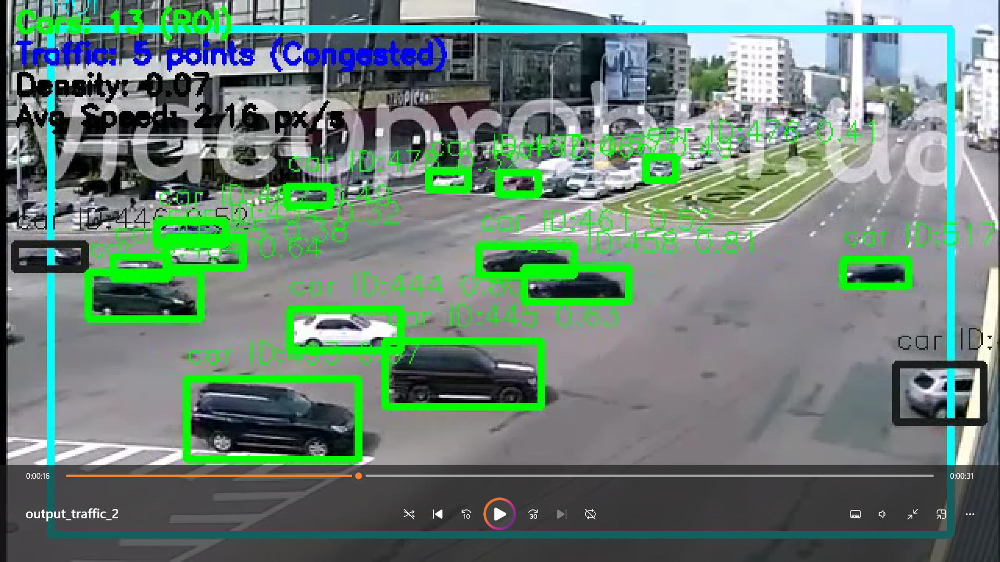
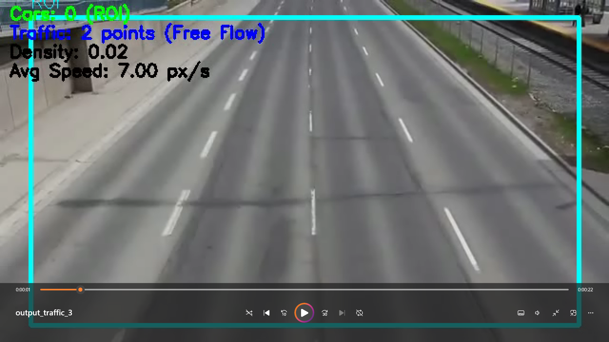

# Traffic Jam Analysis with YOLOv8 and ByteTrack

Модульная система анализа дорожных пробок с использованием **YOLOv8** для детекции транспорта и **ByteTrack** для трекинга объектов. Проект предоставляет автоматизированную оценку трафика по 10-балльной шкале на основе плотности, скорости, количества объектов и других параметров. Поддерживается обработка изображений и видео, включая загрузку с YouTube через `yt-dlp`.

---

## Возможности

- **Детекция и трекинг транспорта**
  - YOLOv8 — современная, точная и быстрая модель детекции объектов, обученная на COCO и поддерживающая классы: автомобиль, автобус, мотоцикл, грузовик и др.
  - ByteTrack — трекер, способный устойчиво отслеживать объекты между кадрами, даже при кратковременных перекрытиях или пропусках
- **Оценка загруженности по 10-балльной шкале**, основанной на:
  - Плотности транспорта в ROI (области интереса)
  - Количестве объектов
  - Средней скорости
  - Дисперсии скоростей
  - Доле неподвижных объектов
- **Сглаживание метрик** — скользящее среднее по 50 кадрам для повышения стабильности показателей
- **Визуализация**:
  - ROI (жёлтая рамка, 90% кадра)
  - Bounding box'ы: зелёные (внутри ROI), серые (вне)
  - Наложение текста с актуальными метриками
- **Поддержка видео и изображений**
- **Загрузка видео с YouTube** через `yt-dlp`
- **Модульная архитектура** — удобна для расширения и поддержки

---

## Структура проекта

```
traffic-jam-analysis/
├── src/
│   ├── detector.py         # YOLOv8 + ByteTrack
│   ├── traffic_analyzer.py # Расчёт метрик и баллов
│   ├── visualizer.py       # Визуализация объектов и графиков
│   ├── processor.py        # Обработка видео/изображений
│   ├── main.py             # Точка входа, YouTube-загрузка
│   └── utils/              # Утилиты (пока пусто)
├── data/
│   └── sample_images/      # Входные изображения
├── output/                 # Промежуточные результаты
├── results/
│   ├── screenshots/        # Скриншоты анализа
│   ├── graphs/             # Графики метрик
│   └── logs/               # Лог-файлы с кадрами и метриками
├── README.md
├── requirements.txt
├── LICENSE
└── .gitignore
```

---

## Установка

```bash
git clone https://github.com/your-username/traffic-jam-analysis.git
cd traffic-jam-analysis
pip install -r requirements.txt
```

---

## Подготовка данных

- Добавьте изображения в папку `data/sample_images/`
- Для работы загрузки видео с YouTube необходим доступ к интернету

---

## Использование

Пример конфигурации в `src/main.py`:

```python
image_dir = "data/sample_images"
image_output_path = "output/output_traffic_images.mp4"
```

Запуск:

```bash
python src/main.py
```

После выполнения будут сформированы:

- Видео с визуализацией (`output/output_traffic_*.mp4`)
- Графики изменения метрик (`output/output_traffic_*_stats.png`)
- Логи анализа (`output/output_traffic_*.txt`)

---

## Результаты

В каталоге `results/` представлены примеры реальной работы системы.

Каждому примеру соответствует три файла:
- **Скриншот** из видео (папка `screenshots/`)
- **График метрик во времени** (папка `graphs/`)
- **Лог-файл** с метриками по каждому кадру (папка `logs/`)

Что видно на примерах:
- Скриншоты демонстрируют корректную детекцию и цветовую разметку объектов в кадре, а также наложение текста с текущими значениями метрик.
- Графики отражают динамику следующих параметров: средняя скорость, плотность, итоговый балл по шкале пробки. Это позволяет визуально оценить изменение ситуации на дороге во времени.
- Логи содержат подробные данные по каждому кадру: количество машин, средняя скорость, плотность и рассчитанный балл.

---

## 📊 Примеры результатов

Проект сохраняет результаты анализа пробок в папке `results/`, которая включает:

- `screenshots/` — кадры с визуализацией объектов и ROI  
- `logs/` — текстовые логи с метриками по кадрам  
- `graphs/` — графики с динамикой трафика (плотность, скорость, баллы)

### Видео 1 — Умеренная пробка



- **Количество машин**: в пределах 8–12  
- **Плотность**: средняя  
- **Скорость**: преимущественно низкая  
- **Оценка трафика**: 4–6 баллов  
- **Комментарий**: движение замедлено, возможны локальные заторы

### Видео 2 — Свободное движение



- **Количество машин**: небольшое  
- **Плотность**: низкая  
- **Скорость**: высокая  
- **Оценка трафика**: 1–2 балла  
- **Комментарий**: движение свободное, пробок нет

### Видео 3 — Серьёзная пробка



- **Количество машин**: высокое  
- **Плотность**: высокая  
- **Скорость**: практически нулевая  
- **Оценка трафика**: 9–10 баллов

---

## Настройки

### Весовые коэффициенты метрик (в `traffic_analyzer.py`):

```python
points = 10 * (
    0.4 * density_norm +
    0.2 * car_count_norm +
    0.2 * (1 - speed_norm) +
    0.1 * (1 - speed_var_norm) +
    0.1 * stationary_ratio
)
```

### Размер окна сглаживания:

```python
window_size = 100
```

### Область интереса (ROI) в кадре (в `processor.py`):

```python
roi = (10, 10, 630, 350)
```

### Примеры ссылок на YouTube (в `main.py`):

```python
video_urls = [
    ("https://www.youtube.com/watch?v=zOq2XdwHGT0", "test_video_1.mp4"),
    ...
]
```

---

## Зависимости

См. `requirements.txt`. Основные библиотеки:

- Python 3.8+
- `opencv-python`
- `ultralytics` — для YOLOv8
- `matplotlib`
- `lap`
- `numpy`
- `yt-dlp`

Установка зависимостей:

```bash
pip install -r requirements.txt
```

---

## Лицензия

Проект распространяется под лицензией MIT. См. файл [LICENSE](./LICENSE).